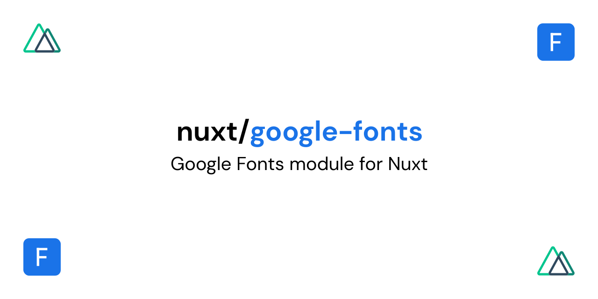

[](https://google-fonts.nuxtjs.org)

# @nuxtjs/google-fonts

[![npm version][npm-version-src]][npm-version-href]
[![npm downloads][npm-downloads-src]][npm-downloads-href]
[![Github Actions CI][github-actions-ci-src]][github-actions-ci-href]
[![Codecov][codecov-src]][codecov-href]
[![License][license-src]][license-href]

> [Google Fonts](https://developers.google.com/fonts) module for [NuxtJS](https://nuxtjs.org)

- [📖 **Release Notes**](./CHANGELOG.md)
- [📖 &nbsp;Documentation](https://google-fonts.nuxtjs.org)

## Features

- Specify fonts by name/variant
- Parse head links to Google Fonts
- Creates only an external link to Google Fonts
- [Support CSS API v2](https://developers.google.com/fonts/docs/css2)
- [Add dns-prefetch](https://developer.mozilla.org/en-US/docs/Web/Performance/dns-prefetch)
- [Add preconnect](https://developer.mozilla.org/en-US/docs/Web/Performance/dns-prefetch#Best_practices)
- [Add preload](https://developer.mozilla.org/pt-BR/docs/Web/HTML/Preloading_content)
- Download css/fonts to local project (No need external resources)
- Encode fonts to base64

[📖 &nbsp;Read more](https://google-fonts.nuxtjs.org)

## Setup

1. Add `@nuxtjs/google-fonts` dependency to your project

```bash
yarn add --dev @nuxtjs/google-fonts # or npm install --save-dev @nuxtjs/google-fonts
```

2. Add `@nuxtjs/google-fonts` to the `buildModules` section of `nuxt.config.js`

```js
{
  buildModules: [
    // Simple usage
    '@nuxtjs/google-fonts',

    // With options
    ['@nuxtjs/google-fonts', { /* module options */ }]
  ]
}
```

:warning: If you are using Nuxt **< v2.9** you have to install the module as a `dependency` (No `--dev` or `--save-dev` flags) and use `modules` section in `nuxt.config.js` instead of `buildModules`.

### Using top level options

```js
export default {
  buildModules: [
    '@nuxtjs/google-fonts'
  ],
  googleFonts: {
    /* module options */
  }
}
```

## Options

See [module options](https://google-fonts.nuxtjs.org/options).

### `families`

- Type: `Object`
- Default: `{}`

```js
{
  families: {
    Roboto: true,
    'Josefin+Sans': true,
    Lato: [100, 300],
    Raleway: {
      wght: [100, 400],
      ital: [100]
    },
  }
}
```

See https://developers.google.com/fonts/docs/css2#quickstart_guides

### `display`

- Type: `String`
- Default: `null`

The font-display property lets you control what happens while the font is still loading or otherwise unavailable.

```js
{
  display: 'swap' // 'auto' | 'block' | 'swap' | 'fallback' | 'optional'
}
```

See https://developers.google.com/fonts/docs/css2#use_font-display

### `subsets`

- Type: `Array[String]|String`
- Default: `[]`

Some of the fonts in the Google Font Directory support multiple scripts (like Latin, Cyrillic, and Greek for example). In order to specify which subsets should be downloaded the subset parameter should be appended to the URL.

See https://developers.google.com/fonts/docs/getting_started#specifying_script_subsets

### `prefetch`

- Type: `Boolean`
- Default: `true`

This option inject `<link rel =" dns-prefetch "href =" https://fonts.gstatic.com/ "/>` into your project header.

See https://developer.mozilla.org/en-US/docs/Web/Performance/dns-prefetch

### `preconnect`

- Type: `Boolean`
- Default: `true`

This option inject `<link rel="preconnect" href="https://fonts.gstatic.com/" crossorigin />` into your project header.

See https://developer.mozilla.org/en-US/docs/Web/Performance/dns-prefetch#Best_practices

### `preload`

- Type: `Boolean`
- Default: `true`

This option inject `<link rel="preload" as="style" href="https://fonts.googleapis.com/css2?family=Roboto" />` into your project header, optionally increase loading priority.

See https://developer.mozilla.org/pt-BR/docs/Web/HTML/Preloading_content

### `useStylesheet`

- Type: `Boolean`
- Default: `false`

This option inject `<link rel="stylesheet" href="https://fonts.googleapis.com/css2?family=Roboto" />` into your project header, recommended for projects that use the AMP module that removes scripts.

### `download`

See [downloading Google Fonts](https://google-fonts.nuxtjs.org/downloading)

- Type: `Boolean`
- Default: `false`

This option you can download css and google sources for your local project.
This means that your project will not depend on these external resources.

> **Note:** The options below are only used when this option is enabled.

### `base64`

- Type: `Boolean`
- Default: `false`

This option encode the fonts and inject directly into the generated css file.

### `inject`

- Type: `Boolean`
- Default: `true`

This option inject the globally generated css file.

See https://nuxtjs.org/api/configuration-css/

### `overwriting`

- Type: `Boolean`
- Default: `false`

This option prevents files from being downloaded more than once.

### `outputDir`

- Type: `String`
- Default: `this.options.dir.assets`

Specifies the output directory for downloaded files.

### `stylePath`

- Type: `String`
- Default: `'css/fonts.css'`

Specifies the path of the css file to be generated.

### `fontsDir`

- Type: `String`
- Default: `'fonts'`

Specifies the directory where the fonts will be downloaded.

**Note:** This option is used if the `base64` option is disabled.

### `fontsPath`

- Type: `String`
- Default: `'~assets/fonts'`

Specifies the path of the fonts within the generated css file.

**Note:** This option is used if the `base64` option is disabled.

## Development

1. Clone this repository
2. Install dependencies using `yarn install` or `npm install`
3. Start development server using `npm run dev`

## License

[MIT License](./LICENSE)

Copyright (c) Nuxt Community

<!-- Badges -->
[npm-version-src]: https://img.shields.io/npm/v/@nuxtjs/google-fonts/latest.svg
[npm-version-href]: https://npmjs.com/package/@nuxtjs/google-fonts

[npm-downloads-src]: https://img.shields.io/npm/dt/@nuxtjs/google-fonts.svg
[npm-downloads-href]: https://npmjs.com/package/@nuxtjs/google-fonts

[github-actions-ci-src]: https://github.com/nuxt-community/google-fonts-module/workflows/ci/badge.svg
[github-actions-ci-href]: https://github.com/nuxt-community/google-fonts-module/actions?query=workflow%3Aci

[codecov-src]: https://img.shields.io/codecov/c/github/nuxt-community/google-fonts-module.svg
[codecov-href]: https://codecov.io/gh/nuxt-community/google-fonts-module

[license-src]: https://img.shields.io/npm/l/@nuxtjs/google-fonts.svg
[license-href]: https://npmjs.com/package/@nuxtjs/google-fonts
